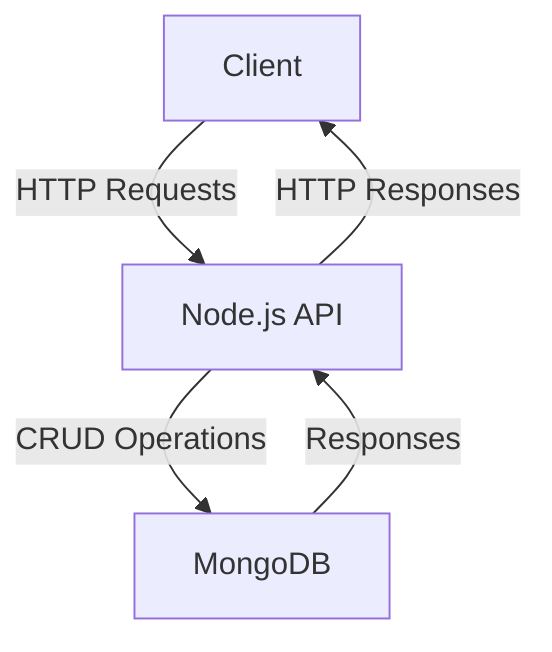
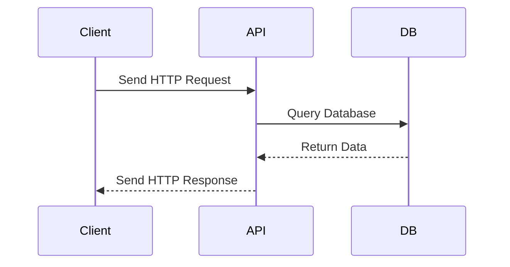

# Sample Node.js Application

This document provides an overview of a sample Node.js application, including its architecture and workflow.

---

## Application Overview

This Node.js application is a simple REST API that allows users to manage a collection of items. It uses Express.js for routing and MongoDB as the database.

---

## Architecture Diagram



---

## Workflow Diagram



---

## Key Features

- **Express.js**: Lightweight and flexible web framework.
- **MongoDB**: NoSQL database for storing data.
- **RESTful API**: Provides endpoints for CRUD operations.

---

## Reference Links

- [Node.js Documentation](https://nodejs.org/en/docs/)
- [Express.js Guide](https://expressjs.com/)
- [MongoDB Documentation](https://www.mongodb.com/docs/)
- [Mermaid.js Documentation](https://mermaid-js.github.io/mermaid/#/)

---

## Getting Started

1. Clone the repository:
   ```bash
   git clone https://github.com/your-repo/sample-nodejs-app.git
   cd sample-nodejs-app
   ```

2. Install dependencies:
   ```bash
   npm install
   ```

3. Start the application:
   ```bash
   npm start
   ```

4. Access the API at `http://localhost:3000`.

---

## License

This project is licensed under the [MIT License](LICENSE).